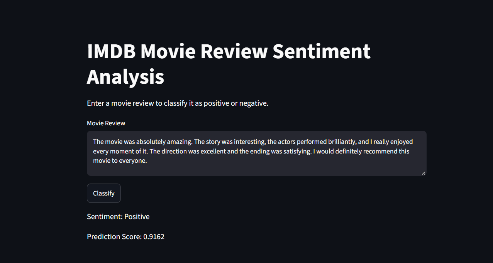
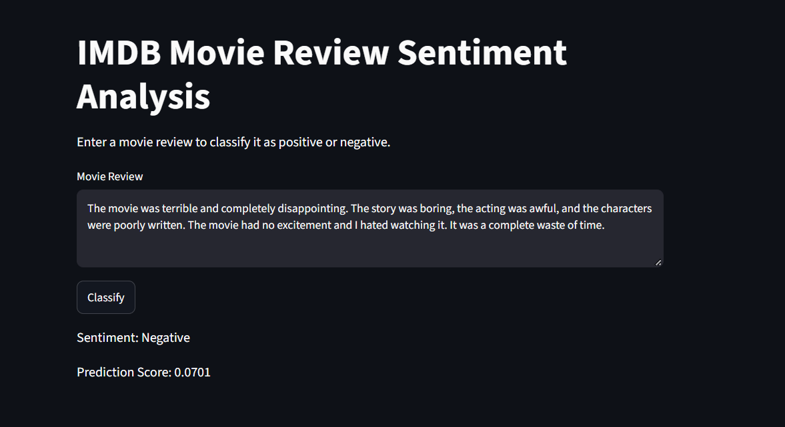

# 🎬 Movie Review Sentiment Analysis using Simple RNN

A deep learning project that uses a **Simple Recurrent Neural Network (RNN)** to classify movie reviews as **Positive** or **Negative**.

The project provides an interactive **Streamlit web application** where users can enter a movie review and instantly receive the predicted sentiment along with the prediction score.

---

## 📌 Project Overview

Sentiment Analysis is a Natural Language Processing (NLP) technique used to determine the emotional tone of text.

In this project, a **Simple RNN** is trained on movie reviews to learn patterns associated with positive and negative sentiments.

The trained model takes a movie review as input and produces a prediction score:

- **Prediction Score > 0.5 → Positive**
- **Prediction Score ≤ 0.5 → Negative**

The model is integrated into a Streamlit application to provide an easy-to-use interface for testing new movie reviews.

---
## 📸 Screenshots

### 😊 Positive Review



### 😞 Negative Review


     ↓
Positive / Negative

## ✨ Features

- 🎬 Movie review sentiment classification
- 🧠 Simple RNN deep learning model
- 📝 Accepts custom movie reviews
- 😊 Detects Positive reviews
- 😞 Detects Negative reviews
- 📊 Displays prediction score
- 🌐 Interactive Streamlit web interface
- ⚡ Real-time prediction

---

## 🛠️ Technologies Used

- **Python**
- **TensorFlow / Keras**
- **Simple RNN**
- **Natural Language Processing (NLP)**
- **NumPy**
- **Streamlit**
- **Jupyter Notebook / Python**
- **Git & GitHub**

---

## 🧠 Model Architecture

The project uses a Simple Recurrent Neural Network for text classification.

### Model Flow

```text
Movie Review
     ↓
Text Preprocessing
     ↓
Tokenization
     ↓
Sequence Conversion
     ↓
Padding
     ↓
Embedding Layer
     ↓
Simple RNN Layer
     ↓
Dense Layer
     ↓
Sigmoid Activation


